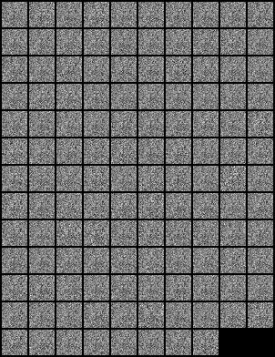

# GAN - Generative Adversarial Networks

Run it on VSCode:

Author:
- Github: khoitran2003
- Email: anhkhoi246813579@gmail.com

## Paper

[Generative Adversarial Networks](https://arxiv.org/abs/1406.2661)

### Authors
Ian J. Goodfellow, Jean Pouget-Abadie, Mehdi Mirza, Bing Xu, David Warde-Farley, Sherjil Ozair, Aaron Courville, Yoshua Bengio
### Abstact

We propose a new framework for estimating generative models via an adversarial process, in which we simultaneously train two models: a generative model G that captures the data distribution, and a discriminative model D that estimates the probability that a sample came from the training data rather than G. The training procedure for G is to maximize the probability of D making a mistake. This framework corresponds to a minimax two-player game. In the space of arbitrary functions G and D, a unique solution exists, with G recovering the training data distribution and D equal to 1/2 everywhere. In the case where G and D are defined by multilayer perceptrons, the entire system can be trained with backpropagation. There is no need for any Markov chains or unrolled approximate inference networks during either training or generation of samples. Experiments demonstrate the potential of the framework through qualitative and quantitative evaluation of the generated samples.

## Getting Started

### Prerequisites

- [Visual Studio Code](https://code.visualstudio.com/download)
- Python 3.10+
- Required Python libraries (listed in `requirements.txt`)

## Result

## License

This project is licensed under the MIT License - see the [LICENSE](LICENSE) file for details.
